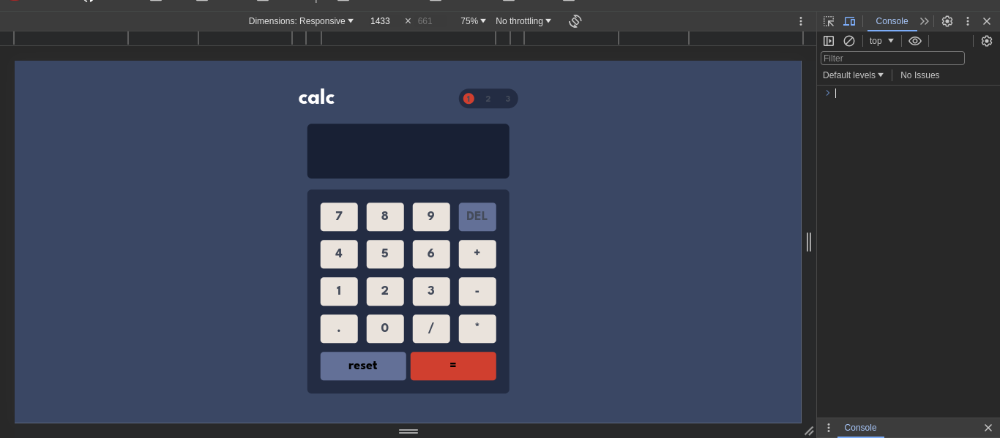
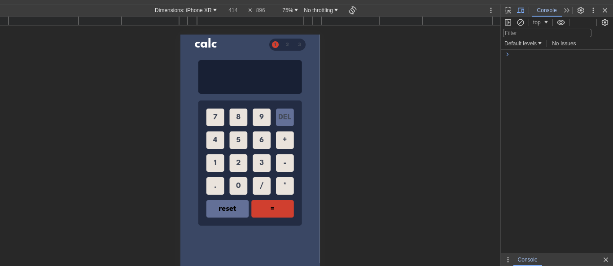

### Calculator apps

## Table of contents

- [Overview](#overview)
  - [The challenge](#the-challenge)
  - [Screenshot](#screenshot)
  - [Links](#links)
- [My process](#my-process)
  - [Built with](#built-with)
  - [What I learned](#what-i-learned)
  - [Continued development](#continued-development)
- [Author](#author)

## Overview

### The challenge

Users are able to:

- See the size of the elements adjust based on their device's screen size
- Perform mathematical operations like addition, subtraction, multiplication, and division
- Adjust the color theme based on their preference

### Screenshot

### Links

- [Solution URL](https://github.com/sadiquex/calculator-app-frontendMentor)
- [Live URL](https://calculator-app-frontend-mentor-eosin.vercel.app/)

## My process

### Built with

- Tailwind CSS
- ReactJS
- Flexbox
- CSS Grid
- Mobile-first workflow

### What I learned

- Using reducer function
- useReducer hook

### Continued development

- Add the functionality to separate numbers with a comma
- initial theme preference checked using `prefers-color-scheme` and have any additional changes saved in the browser

<!-- ## Author -->

<!-- - Website - [Add your name here](https://www.your-site.com)
- Frontend Mentor - [@yourusername](https://www.frontendmentor.io/profile/yourusername)
- Twitter - [@yourusername](https://www.twitter.com/yourusername) -->
